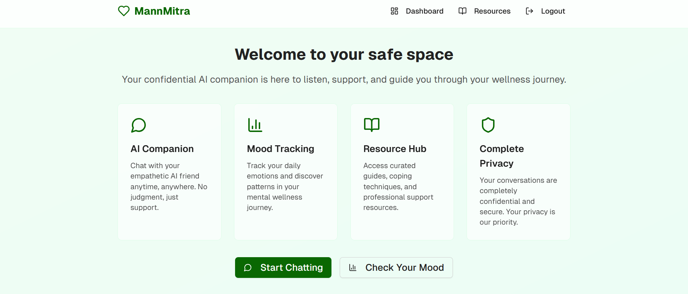
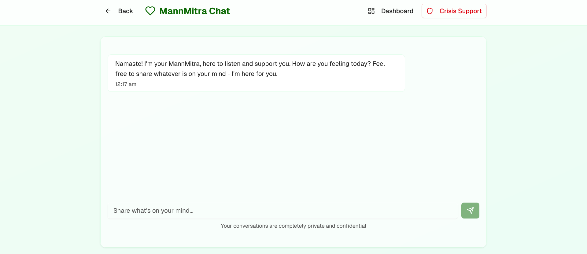
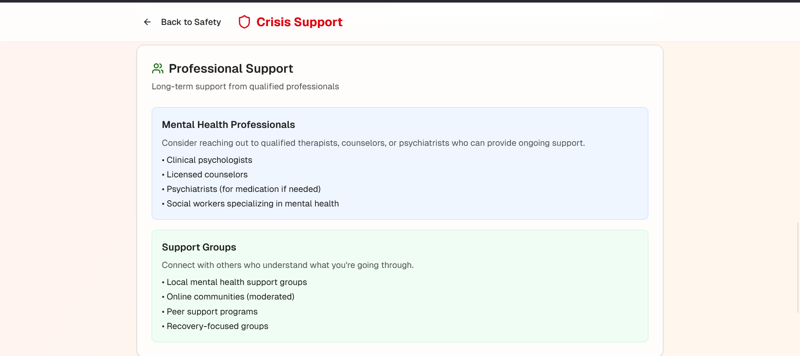

# 🌿 MannMitra - Your Confidential AI Companion

MannMitra is a mental wellness platform built with **Next.js**, designed specifically for Indian youth. It provides a safe, confidential, and culturally aware space with AI-powered chat, mood tracking, crisis support, and educational resources.

## ✨ Features

### 🔒 Authentication
- Anonymous, privacy-first login (no personal details required)
- Session-based authentication for complete anonymity

### 💬 AI Chat
- Gemini-powered conversations with empathetic responses
- Crisis detection alerts for immediate support
- Culturally-aware responses tailored for Indian youth

### 😊 Mood Tracking
- Daily mood check-in with emojis & intensity scale
- Optional notes for self-reflection and personal insights
- Mood history & trends visualization to track progress

### 📊 Wellness Dashboard
- Personalized tips and recommendations
- Streak tracking for consistent wellness habits
- Recent mood and activity overview

### 📚 Resources
- Emergency helplines (India-specific contact numbers)
- Self-help tools and coping strategies
- Youth-focused knowledge base and mental health resources

### 🚨 Crisis Support
- Immediate coping strategies and grounding techniques
- 24/7 helpline numbers for emergency situations
- Professional support links and intervention resources

## 🛠️ Tech Stack

- **Frontend:** Next.js 14 (App Router), React 18
- **Styling:** Tailwind CSS v4, shadcn/ui components
- **Backend:** Next.js API Routes
- **AI Integration:** Google Gemini API
- **Authentication:** Anonymous session-based authentication
- **Theme:** Custom green wellness theme with dark/light mode support
- **TypeScript:** Full TypeScript support for type safety

## 📸 Screenshots

### Dashboard Overview


### AI Chat Interface  


### support


## 📂 Project Structure

```
mannmitra-app/
├── app/
│   ├── page.tsx                 # Home page (login/dashboard)
│   ├── layout.tsx               # Root layout & metadata
│   ├── globals.css              # Global styles
│   ├── chat/                    # AI chat interface
│   │   └── page.tsx
│   ├── mood/                    # Mood check-in & history
│   │   └── page.tsx
│   ├── dashboard/               # Wellness dashboard
│   │   └── page.tsx
│   ├── resources/               # Resource hub
│   │   └── page.tsx
│   ├── crisis/                  # Crisis support page
│   │   └── page.tsx
│   └── api/                     # API routes
│       ├── auth/
│       ├── chat/
│       └── mood/
├── components/
│   ├── ui/                      # shadcn/ui components
│   ├── auth/
│   │   └── login-form.tsx
│   ├── chat/
│   ├── mood/
│   └── dashboard/
├── lib/                         # Utility functions & auth
│   ├── auth.ts
│   ├── utils.ts
│   └── gemini.ts
├── types/                       # TypeScript type definitions
├── public/                      # Static assets
├── package.json
├── tsconfig.json
├── tailwind.config.js
├── next.config.js
├── .env.local.example
├── .gitignore
└── README.md
```

## 🚀 Getting Started

### Prerequisites

- Node.js 18.0 or later
- npm or yarn package manager
- Google Gemini API key

### 1. Clone the Repository

```bash
git clone https://github.com/bhoomisurve/MannMitra.git
cd MannMitra
```

### 2. Install Dependencies

```bash
npm install
# or
yarn install
```

### 3. Set Up Environment Variables

Create a `.env.local` file in the root directory:

```env
NEXT_PUBLIC_GEMINI_API_KEY=your_gemini_api_key_here
NEXTAUTH_SECRET=your_nextauth_secret_here
NEXTAUTH_URL=http://localhost:3000
```

To get your Gemini API key:
1. Visit [Google AI Studio](https://makersuite.google.com/app/apikey)
2. Create a new API key
3. Copy and paste it into your `.env.local` file

### 4. Run the Development Server

```bash
npm run dev
# or
yarn dev
```

Open [http://localhost:3000](http://localhost:3000) in your browser to see the application.

### 5. Build for Production

```bash
npm run build
npm start
```

## 🔧 Configuration

### Environment Variables

| Variable | Description | Required |
|----------|-------------|----------|
| `NEXT_PUBLIC_GEMINI_API_KEY` | Google Gemini API key for AI chat | Yes |
| `NEXTAUTH_SECRET` | Secret for session encryption | Yes |
| `NEXTAUTH_URL` | Base URL of your application | Yes |

### Customization

- **Theme Colors:** Modify `tailwind.config.js` to customize the green wellness theme
- **AI Responses:** Update prompts in `lib/gemini.ts` for culturally-specific responses
- **Resources:** Add more helplines and resources in the resources section

## 🌐 Deployment

### Vercel (Recommended)

1. Push your code to GitHub
2. Connect your repository to [Vercel](https://vercel.com)
3. Add environment variables in the Vercel dashboard
4. Deploy automatically on every push

### Other Platforms

MannMitra can be deployed on any platform that supports Next.js:
- Netlify
- Railway
- DigitalOcean App Platform
- AWS Amplify

## 🤝 Contributing

We welcome contributions to make MannMitra better for Indian youth! Here's how you can help:

### Guidelines

1. **Fork** the repository
2. **Create** a feature branch (`git checkout -b feature/amazing-feature`)
3. **Commit** your changes (`git commit -m 'Add amazing feature'`)
4. **Push** to the branch (`git push origin feature/amazing-feature`)
5. **Open** a Pull Request

### Areas for Contribution

- 🌐 Multi-language support (Hindi, regional languages)
- 🔒 Enhanced privacy features
- 📱 Mobile app development
- 🧠 Advanced mood analytics
- 🎨 UI/UX improvements
- 📚 More mental health resources

## 🛡️ Privacy & Security

- **Anonymous Authentication:** No personal information required
- **Local Data Storage:** Mood data stored locally when possible
- **Encrypted Sessions:** All user sessions are encrypted
- **No Data Selling:** We never sell or share user data
- **GDPR Compliant:** Built with privacy regulations in mind

## 📞 Crisis Resources

If you or someone you know is in crisis, please reach out immediately:

- **KIRAN Mental Health Helpline:** 1800-599-0019
- **Vandrevala Foundation:** 9999 666 555
- **iCall:** 9152987821
- **Emergency Services:** 112

## 🔄 Changelog

### Version 1.0.0 (Initial Release)
- Anonymous authentication system
- AI-powered chat with Gemini integration
- Mood tracking and visualization
- Wellness dashboard
- Crisis support resources
- India-specific helplines and resources

## 📜 License

This project is licensed under the MIT License - see the [LICENSE](LICENSE) file for details.

## 💚 Acknowledgments

- **Inspired by** the critical need for youth mental wellness support in India 🇮🇳
- **Powered by** Next.js, Tailwind CSS, and Google Gemini AI
- **Built for** Indian youth seeking confidential mental health support
- **Special thanks** to the open-source community and mental health advocates

## 📞 Support

If you have questions or need help with MannMitra:

- 🐛 **Bug Reports:** [GitHub Issues](https://github.com/bhoomisurve/MannMitra/issues)
- 💡 **Feature Requests:** [GitHub Discussions](https://github.com/bhoomisurve/MannMitra/discussions)
- 📧 **Contact:** [Create an issue](https://github.com/bhoomisurve/MannMitra/issues/new)

---

**Remember: You are not alone. Help is available, and it's okay to ask for support. 💚**

*MannMitra - Empowering Indian youth with confidential, culturally-aware mental wellness support.*
